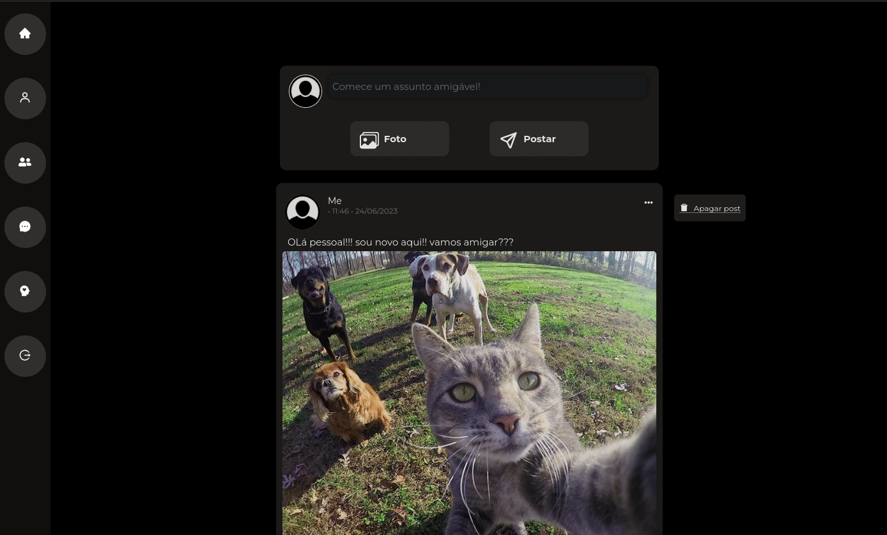
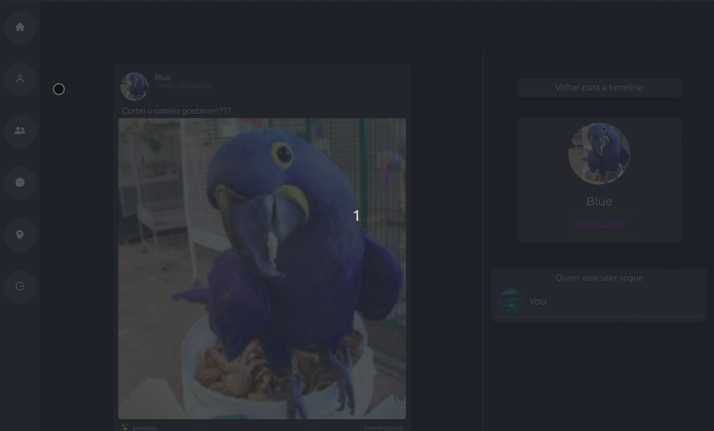
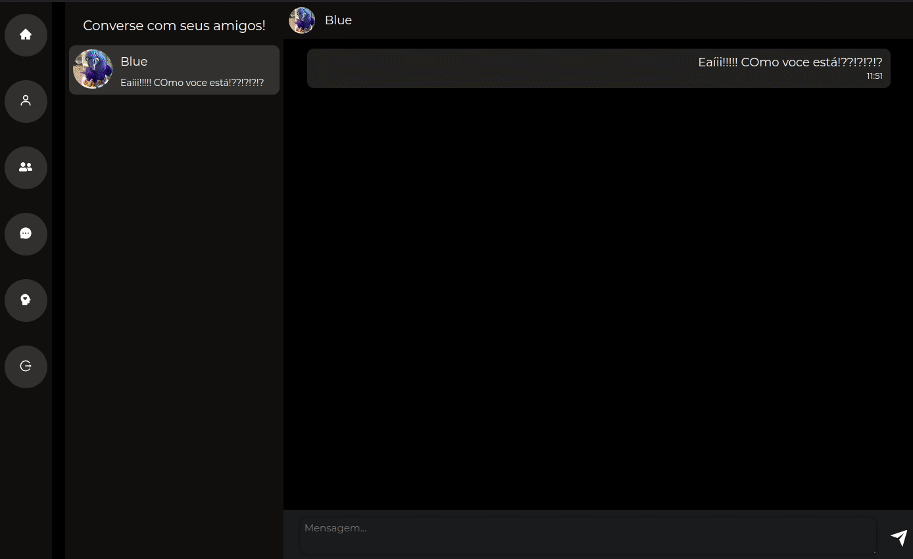

# Friendly: para seu bem-estar mental e social

O Friendly é um aplicativo desenvolvido com o objetivo de promover o bem-estar social e mental dos usuários. Através dele, os usuários podem compartilhar pensamentos, participar de discussões divertidas com amigos e utilizar um diário de humor para acompanhar suas mudanças diárias de humor e fazer anotações.

<h1>Instalação</h1>

1. Clone o repositório:
```bash
git clone https://github.com/RubsRafa/projeto-autoral
```

2. Navegue até o diretório do projeto:
```bash
cd projeto-autoral
```

3. Instale as dependências:
```bash
npm install
```

4. Para iniciar o front, entre no arquivo com o comando:
```bash
cd projeto22-autoral-front-end
```

4. Para iniciar o back, entre no arquivo com o comando:
```bash
cd projeto22-autoral-back-end
```

5. Para iniciar o servidor, rode o comando: 
```bash
npm start
```

6. Lembre de adicionar variáveis de ambiente para fazer o projeto rodar localmente. Você pode utilizar como exemplo o arquivo .env.example.

<h1>Páginas</h1>

<h2>Login e cadastro</h2>


- Essa página permite que você faça o cadastro e o login no site.
- Nome, email e senha são obrigatórios, mas se você quiser, pode adicionar também uma foto de perfil e sua data de aniversário, para que seus amigos possam te desejar parabéns e quem sabe, te comprar um presente!
#
<h2>Feed</h2>


- Aqui no feed, você compartilhar suas idéias, pensamentos, ou momentos engraçados com seus amigos.
- Quando você começar a seguir seus amigos, os posts e reposts deles, vão aparecer pra você.
- Você pode curtir, comentar e compartilhar as postagens dos seus amigos!

<h2>User page</h2>


- Aqui você encontrará todas as informações de um determinado usuário.
- Essa página traz todos os posts e reposts de um determinado usuário, os usuários que ele segue, além de suas informações, como nome, foto e data de aniversário (se o usuário adicionou).



- PS: Se você visitar sua página de usuário, conseguirá alterar suas informações!

<h2>Encontre seus amigos</h2>


- Uma página com layout simples, onde vocẽ pode procurar e encontrar seus amigos pelo nome deles dentro da aplicação. 
- Aproveite para encontrar usuários com nome parecido e interagir com eles!

<h2>Chat</h2>



- Hora de conversar com seus amigos! 
- Aqui você encontrará tanto os usuários que você segue, como usuários que te mandaram mensagem.

<h2>Diário</h2>



- Aqui você pode abrir seu coração, falar sobre seus sentimentos, sobre emoções, fazer anotações importantes, de algum momento importante do dia.
- Se não gostar, você pode deletar. E se quiser alterar alguma informação é possível também.
- Atribua uma cor e um rostinho à sua anotação.

<h1>Endpoints</h1>
<h2>Autenticação</h2>

```bash
POST /auth/signup
```

- Permite que usuário faça registro na aplicação.
- Obrigatórios: nome, email, senha, confirmação da senha.
- Opcionais: foto e data de aniversário.

```bash
POST /auth/signin
```
- Permite que usuário faça login na aplicação.
- Obrigatórios: email e senha.

**OBS: Para todas as rotas abaixo, é necessária a autenticação do usuário.

#
<h2>Posts</h2>

```bash
GET /posts
```
- Faz uma filtragem dos posts, e retorna somente os posts e reposts do próprio usuário, além de posts e reposts dos usuários a quem ele segue.

```bash
GET /posts/user/:userId
```
- Retorna somente os posts e reposts de um usuário em específico.

```bash
POST /posts
```
- Permite que usuário possa realizar suas postagens, sendo elas de texto ou imagem, ou ambos.
- Obrigatório: pelo menos o texto ou a imagem. 

```bash
DELETE /posts/:postId
```
- Permite que usuário possa apagar postagem, caso ela seja de sua autoria. 
#
<h2>Like</h2>

```bash
GET /like/users
```
- Retorna informações dos usuários (nome e foto) junto com o id do post que eles curtiram.

```bash
GET /like
```
- Retorna somente os ids dos posts que o usuário logado curtiu. 

```bash
POST /like
```
- Permite que o usuário adicione um like um post.
- Verifica se o usuário já curtiu aquele post antes.

```bash
DELETE /like
```
- Permite que o usuário remova seu like de um post.
- Verifica se o usuário já curtiu aquele post para remover o like.
#
<h2>Comment</h2>

```bash
GET /comment
```
- Retorna comentários dos usuários em cada post, junto com suas informações (nome e foto).

```bash
POST /comment
```
- Permite que usuário adicione comentários em cada post, quantas vezes ele quiser.
- Obrigatório: comentário, id do usuário existente, e id do post existente.

```bash
DELETE /comment/:commentId
```
- Permite que usuário remova seu comentário.
#
<h2>Repost</h2>

```bash
POST /repost
```
- Permite que usuário reposte uma postagem, verificando se o usuário já não repostou.

```bash
DELETE /repost/:postId
```
- Permite que usuário remova seu post, verificando se usuário não possui nenhuma repostagem direcionada aquele post.
#
<h2>Users</h2>

```bash
GET /users/find/:name
```
- Permite que usuário encontre outros usuários a partir do seu nome. 

```bash
GET /users/:userId
```
- Retorna informações do usuário, que ficarão públicas para outros usuário (nome, foto, data de aniversário). 

```bash
PUT /users/edit
```
- Permite que usuário edite todas as suas informações.
- Nota: Para editar a senha, é necessário a confirmação da senha anterior. 
#
<h2>Follow</h2>

```bash
GET /follow/:userId
```
- Retorna informações dos usuários que o usuário logado segue.
- Retorna id, nome e foto do usuário seguido.

```bash
POST /follow
```
- Permite que usuário siga outro, verificando se aquele follow ainda não existia. 

```bash
DELETE /follow/:followId
```
- Permite que usuário pare de seguir outro, verificando se aquele follow já existia.
#
<h2>Mental-Health</h2>

```bash
GET /mental-health
```
- Retorna informações referente ao diário de humor do usuário.
- Retorna data e horário em que o sentimento foi adicionado, texto, cor e modo (que no front, se refere a um emoji).

```bash
POST /mental-health
```
- Permite que usuário adicione um novo sentimento para seu diário.
- Obrigatório: cor (padrão: preto), modo (padrão: 3), e texto.

```bash
PUT /mental-health
```
- Permite que usuário edite somente o texto do sentimento adicionado. 

```bash
DELETE /mental-health
```
- Permite que usuário delete seu sentimento do diário.
#
<h2>Chat</h2>

```bash
GET /chat/users
```
- Retorna usuários e sua última mensagem.

```bash
GET /chat/:userId
```
- Retorna todas as mensagens do usuário logado com determinado usuário.

```bash
POST /chat
```
- Permite que usuário logado envie mensagens para seus amigos, verificando se a existência do usuário.

```bash
DELETE /chat/:messageId
```
- Permite que usuário apague mensagem enviada dentro da área de bate-papo.


# Testes
- A Friendly API inclui testes de integração e unitários para garantir a qualidade e estabilidade do código. 
- Para rodar os testes localmente, basta seguir os seguintes comandos:

1. No terminal, depois de clonar o repositório e instalar as dependência, rode:
```bash
npm run test
```

2. Se deseja ver o nível de cobertura dos testes, rode o comando:
```bash
npm run test:coverage
```

# Docker
A Friendly API pode ser facilmente executada usando contêineres Docker para garantir um ambiente de desenvolvimento e implantação consistente. 

Para executar a Friendly API usando o docker, siga as etapas abaixo:
1. Certifique-se de ter o Docker instalado na sua máquina.

2. Altere as variáveis de ambiente para acessar os contêiners, seguindo o arquivo docker-compose.yml.

3. No diretório raiz do projeto (onde contêm o arquivo docker-compose), execute o seguinte comando:
```bash
docker-compose up -d #para executar em segundo plano
```

# CI/CD

A Friendly API também utiliza integração contínua (CI) e implantação contínua (CD) para automatizar o processo de teste e implantação da aplicação.